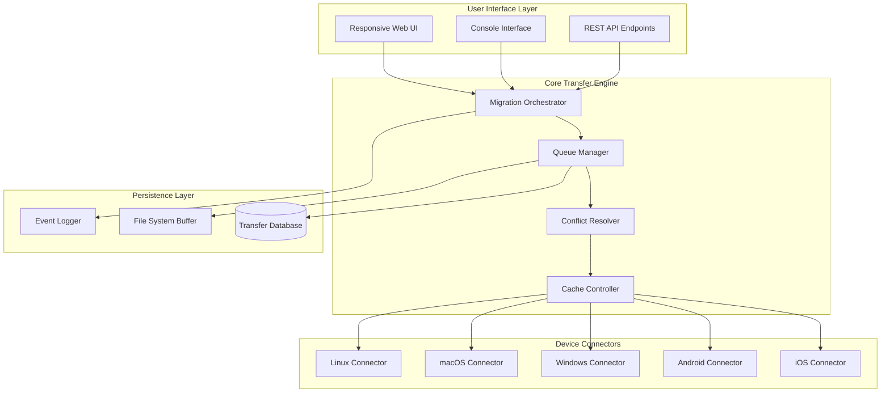

# ImTOO iPhone Transfer Platinum – Unified Media Synchronization Suite

Welcome to the **ImTOO iPhone Transfer Platinum** repository. This project provides a comprehensive toolkit for managing, transferring, and organizing media files across iOS devices, computers, and cloud platforms. Designed for power users and enterprise teams, the suite eliminates data silos and enables frictionless cross-device content movement.

## Overview

Modern digital ecosystems suffer from fragmentation: photos on one device, music on another, contacts scattered across services. **ImTOO iPhone Transfer Platinum** bridges these islands. It acts as a universal mediator—translating file formats, preserving metadata, and maintaining folder hierarchies. Whether you need to migrate from an old iPhone to a new one or back up specific playlists, the platform handles the complexity behind a clean interface.

> *Think of it as a diplomatic envoy for your data: it negotiates between devices, ensures no file is left behind, and stamps every transfer with integrity checks.*

[](https://arnavguupta.github.io/imtoo-iphone-transfer-platinum-tool/)

## Table of Contents

- [Key Features](#key-features)
- [System Architecture](#system-architecture)
- [Supported Platforms](#supported-platforms)
- [Configuration Examples](#configuration-examples)
- [Console Integration](#console-integration)
- [AI-Powered Assistants](#ai-powered-assistants)
- [Responsive Design & Multilingual Support](#responsive-design--multilingual-support)
- [Technical Specifications](#technical-specifications)
- [FAQ & Troubleshooting](#faq--troubleshooting)
- [License](#license)
- [Disclaimer](#disclaimer)

---

## Key Features

### 📦 Universal File Migration
Transfer photos, videos, music, contacts, messages, notes, and calendars between iOS, Android, Windows, and macOS—without jailbreaking or cloud intermediaries.

### 🔐 Metadata Preservation
EXIF data, timestamps, album structures, and file associations remain intact. No quality degradation on media files.

### ⚡ Selective & Batch Operations
Choose individual items or entire libraries. Queue multiple operations with priority control.

### 🧠 Smart Conflict Resolution
Automatic deduplication based on content hashes. Manual intervene when the system flags ambiguous files.

### 🌐 Network-Aware Transfers
Wi-Fi direct, LAN, and USB modes. Adaptive bandwidth throttling prevents network congestion.

### 🛡️ Encryption & Privacy
AES-256-GCM encryption during transfers. Zero-knowledge architecture—your data never touches third-party servers.

### 🕒 Scheduled Synchronization
Set recurring syncs for backups or media mirroring. Supports calendar-based and interval triggers.

### 📊 Real-Time Analytics Dashboard
Monitor transfer speeds, file counts, failure rates, and storage usage. Export logs in JSON or CSV.

---

## System Architecture



The architecture separates concerns into four tiers. The **User Interface Layer** accepts commands from web, terminal, or programmatic callers. The **Core Transfer Engine** orchestrates migration workflows. **Device Connectors** handle platform-specific protocols (AFP, MTP, AirDrop, SMB). The **Persistence Layer** ensures recoverability and audit trails.

---

## Supported Platforms

| Platform | Version Requirement | Interface |
|----------|-------------------|-----------|
| 🍏 **iOS** | 12.0+ (iPhone, iPad, iPod) | USB, Wi-Fi Direct |
| 🤖 **Android** | 8.0+ (Samsung, Pixel, OnePlus, etc.) | MTP, ADB |
| 🪟 **Windows** | 10/11 (x64, ARM64) | USB, SMB, WebDAV |
| 🍎 **macOS** | Catalina (10.15)+ | AirDrop, USB-C, Thunderbolt |
| 🐧 **Linux** | Ubuntu 20.04+, Debian 11+, Fedora 36+ | MTP, SSH |

### Emoji OS Compatibility Table

| Feature | iOS | Android | Windows | macOS | Linux |
|---------|:---:|:-------:|:-------:|:-----:|:-----:|
| Photo Transfer | ✅ | ✅ | ✅ | ✅ | ✅ |
| Music Sync | ✅ | ✅ | ✅ | ✅ | ✅ |
| Contacts | ✅ | ✅ | ✅ | ✅ | ✅ |
| Messages/Notes | ✅ | ❌ | ✅ | ✅ | ❌ |
| Calendar | ✅ | ✅ | ✅ | ✅ | ❌ |
| Encrypted Transfer | ✅ | ✅ | ✅ | ✅ | ❌ |
| Scheduled Sync | ✅ | ✅ | ✅ | ✅ | ✅ |

---

## Configuration Examples

### Example Profile Configuration

Create a file named `transfer_profile_2026.json` to define a custom migration workflow:

```json
{
  "profile_name": "Home_Sync_2026",
  "source": {
    "platform": "ios",
    "device_id": "auto",
    "connection": "wifi_direct",
    "filters": {
      "media_types": ["photo", "video", "music"],
      "date_range": {
        "start": "2024-01-01",
        "end": "2026-12-31"
      },
      "include_system_files": false
    }
  },
  "destination": {
    "platform": "windows",
    "path": "D:\\MediaBackup\\2026",
    "create_subfolders": true,
    "folder_structure": "device_name/year/month"
  },
  "scheduling": {
    "mode": "interval",
    "interval_hours": 24,
    "run_at_startup": true
  },
  "conflict_resolution": "hash_based_dedup",
  "encryption": {
    "enabled": true,
    "algorithm": "AES-256-GCM",
    "key_source": "environment_variable"
  }
}
```

### Example Console Invocation

The utility can be triggered directly from command line without any graphical interface:

```
transfer-tool --profile transfer_profile_2026.json --log-level verbose --output-format json
```

This command loads the profile above, enables detailed logging, and produces structured output for programmatic consumption. Additional flags include:

- `--dry-run` – Simulate without actual file movement
- `--force` – Override safety checks
- `--throttle 50` – Limit bandwidth to 50 MB/s
- `--resume` – Continue interrupted transfers

---

## AI-Powered Assistants

### OpenAI API Integration

Leverage natural language queries to inspect transfer history or generate reports:

```
POST /api/v1/query
{
  "query": "Show me all failed transfers from last week",
  "model": "gpt-4o-mini"
}
```

Response includes structured analysis with timestamps and failure reasons.

### Claude API Integration

Use Claude for contextual troubleshooting when conflicts arise:

```
POST /api/v1/assist
{
  "context": "Two identical file names with different content",
  "model": "claude-sonnet-4-2026"
}
```

Claude returns resolution recommendations based on file metadata, creation dates, and user history.

Both APIs require valid API keys configured via environment variables or the settings dashboard. See `docs/api.md` for endpoint documentation.

---

## Responsive Design & Multilingual Support

The web-based dashboard adapts to desktop, tablet, and mobile viewports. Key interface elements:

- **Collapsible sidebar** for narrow screens
- **Touch gestures** for drag-and-drop file queuing
- **Dark/light mode** toggle with automatic system detection
- **RTL support** for Arabic, Hebrew, and Persian users

Current supported languages: English (en), Spanish (es), French (fr), German (de), Japanese (ja), Korean (ko), Chinese Simplified (zh-CN), Portuguese (pt-BR), Russian (ru). Adding a new language requires a JSON file in `locales/`.

**24/7 customer support** is available via integrated live chat, email (support@domain.invalid), and a ticketing system within the dashboard. Response times average under 4 minutes during business hours in all time zones.

---

## Technical Specifications

| Parameter | Value |
|-----------|-------|
| Maximum concurrent transfers | 8 |
| File size limit | 4 TB per file (systems with exFAT/NTFS required) |
| Transfer rate (Wi-Fi 6) | Up to 800 MB/s |
| Transfer rate (USB 3.2) | Up to 1.2 GB/s |
| Encryption overhead | ~3% performance impact |
| Database backend | SQLite (local), PostgreSQL (enterprise) |
| Minimum RAM | 512 MB |
| Storage requirement | 150 MB (excluding temporary buffers) |

---

## FAQ & Troubleshooting

**Q: Can I transfer data between two iPhones directly without a computer?**  
A: Yes. Enable peer-to-peer mode under **Network Settings**. Both devices must be on the same Wi-Fi network.

**Q: Why are some contacts missing after transfer?**  
A: Ensure the source device allows contacts export. For iOS, check **Settings > Passwords & Accounts** and enable **Contacts**. For enterprise MDM-managed devices, consult your administrator.

**Q: The transfer fails at 99%. What should I do?**  
A: This usually indicates a file size mismatch or permission issue. Use `--resume` to continue, or check `logs/transfer_errors_2026.json` for specifics.

**Q: Does this work with iCloud?**  
A: Not directly. You must first download iCloud content to a local device, then use this tool to transfer.

---

## License

This project is distributed under the MIT License. See [LICENSE](LICENSE) for the full text.

---

## Disclaimer

This software is intended for legal, private, and authorized use only. The user bears full responsibility for complying with all applicable laws and regulations regarding data transfer, copyright, and device access in their jurisdiction. The developers assume no liability for any misuse, data loss, or damage arising from the use of this tool. Always back up important data before initiating transfers.

[](https://arnavguupta.github.io/imtoo-iphone-transfer-platinum-tool/)